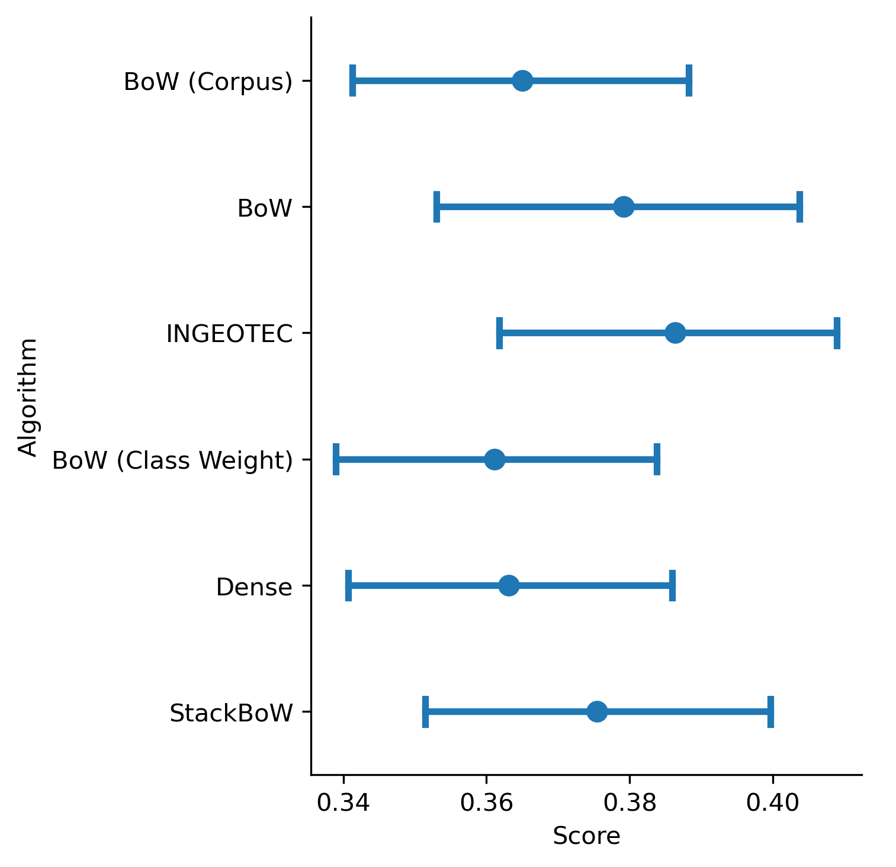

.. _CompStats:

====================================
CompStats
====================================
.. image:: https://github.com/INGEOTEC/CompStats/actions/workflows/test.yaml/badge.svg
		:target: https://github.com/INGEOTEC/CompStats/actions/workflows/test.yaml

.. image:: https://coveralls.io/repos/github/INGEOTEC/CompStats/badge.svg?branch=develop
		:target: https://coveralls.io/github/INGEOTEC/CompStats?branch=develop

.. image:: https://badge.fury.io/py/CompStats.svg
		:target: https://badge.fury.io/py/CompStats

.. image:: https://dev.azure.com/conda-forge/feedstock-builds/_apis/build/status/compstats-feedstock?branchName=main
	    :target: https://dev.azure.com/conda-forge/feedstock-builds/_build/latest?definitionId=20297&branchName=main

.. image:: https://img.shields.io/conda/vn/conda-forge/compstats.svg
		:target: https://anaconda.org/conda-forge/compstats

.. image:: https://img.shields.io/conda/pn/conda-forge/compstats.svg
		:target: https://anaconda.org/conda-forge/compstats

.. image:: https://readthedocs.org/projects/compstats/badge/?version=latest
		:target: https://compstats.readthedocs.io/en/latest/?badge=latest

Collaborative competitions have gained popularity in the scientific and technological fields. These competitions involve defining tasks, selecting evaluation scores, and devising result verification methods. In the standard scenario, participants receive a training set and are expected to provide a solution for a held-out dataset kept by organizers. An essential challenge for organizers arises when comparing algorithms' performance, assessing multiple participants, and ranking them. Statistical tools are often used for this purpose; however, traditional statistical methods often fail to capture decisive differences between systems' performance. :py:class:`CompStats` implements an evaluation methodology for statistically analyzing competition results and competition. :py:class:`CompStats` offers several advantages, including off-the-shell comparisons with correction mechanisms and the inclusion of confidence intervals. 

Quickstart Guide
====================================

The first step is to install CompStats, which is described below.

Installing CompStats
^^^^^^^^^^^^^^^^^^^^^^^^^^^^^^^^^^^^^

The first step is to install the library, which can be done using the `conda package manager <https://conda-forge.org/>`_ with the following instruction. 

.. code:: bash

	  conda install -c conda-forge CompStats

A more general approach to installing CompStats is through the use of the command pip, as illustrated in the following instruction. 

.. code:: bash

	  pip install CompStats

Libraries used
^^^^^^^^^^^^^^^^^^^^^

After installing :py:class:`CompStats`, we must import the necessary libraries for our analysis. :py:class:`CompStats` relies on several Python libraries for data analysis and scientific computing.

The first line of the following code loads two functions from the :py:class:`CompStats` library. The :py:func:`~CompStats.performance.performance` function is used to calculate and analyze the performance of machine learning models. On the other hand, the :py:func:`~CompStats.performance.plot_performance` function visualizes the performance metrics calculated by :py:func:`~CompStats.performance.performance`, such as accuracy or F1 score, along with confidence intervals to help understand the variability and reliability of the performance metrics.

The second line imports two functions: :py:func:`~CompStats.performance.difference` and :py:func:`~CompStats.performance.plot_difference`; :py:func:`~CompStats.performance.difference` assesses the differences in performance between models in comparison to the best system, and :py:func:`~CompStats.performance.plot_difference` visually represents these differences relative to the best system.

The third line imports two functions: :py:func:`~CompStats.performance.all_differences` and :py:func:`~CompStats.measurements.difference_p_value`. :py:func:`~CompStats.performance.all_differences` evaluates the differences in performance between all models, and :py:func:`~CompStats.measurements.difference_p_value` estimates the p-value of the hypothesis that the difference is significantly greater than zero.

The fourth line imports the function :py:func:`multipletests` that is used for adjusting p-values when multiple hypothesis tests are performed, to control for the false discovery rate or family-wise error rate.

The rest of the lines load commonly used Python libraries.

.. code-block:: python

    >>> from CompStats import performance, plot_performance
    >>> from CompStats import difference, plot_difference
    >>> from CompStats import all_differences, difference_p_value
    >>> from statsmodels.stats.multitest import multipletests
    >>> from sklearn.metrics import f1_score
    >>> import pandas as pd

Dataset
^^^^^^^^^^^^^^^^^^^^^

Once we have set up our environment, we can explore what CompStats offers. Let's begin with a basic example of how to use CompStats for a simple statistical analysis.

To illustrate the use of CompStats, we will use a dataset included in the CompStats package. The path of the dataset is found with the following instructions. The variable :py:attr:`DATA` contains the path as shown below.  

.. code-block:: python

    >>> from CompStats.tests.test_performance import DATA
    >>> DATA
    '/usr/local/lib/python3.10/dist-packages/CompStats/tests/data.csv'

:py:attr:`DATA` contains the information to compare six systems for a multiclass classification task. The next instruction loads the data into a dataframe.

.. code-block:: python

    >>> df = pd.read_csv(DATA)

It can be observed that the first column contains the gold standard, identified with :py:attr:`y`, and the rest of the columns are the predictions performed by different systems.

.. code-block:: python

    >>> df.columns
    Index(['y', 'BoW (Corpus)', 'BoW', 'INGEOTEC',
           'BoW (Class Weight)', 'Dense', 'StackBoW'],
          dtype='object')

Performance Analysis
^^^^^^^^^^^^^^^^^^^^^^^^^^^^^

Let us start with the performance analysis of the different systems. The performance metric used is the weighted average F1 score. This performance is coded in the variable :py:attr:`score` as observed in the next instruction.

.. code-block:: python

    >>> score = lambda y, hy: f1_score(y, hy, average='weighted')

The next step is to compute the performance on the bootstrap samples; this is done with the function :py:func:`~CompStats.performance.performance`. The function has a few parameters; one is the :py:attr:`score`, which receives the metric used to measure the performance.

.. code-block:: python

    >>> perf = performance(df, score=score, num_samples=1000)

:py:attr:`perf` is an instance of :py:class:`~CompStats.bootstrap.StatisticSamples`, the bootstrap samples can be seen on the property :py:attr:`calls`. The first five bootstrap samples of the performance of INGEOTEC are shown below. 

.. code-block:: python

    >>> perf.calls['INGEOTEC'][:5]
    [0.37056471 0.38665852 0.36580968 0.39611708 0.39422416]

The performance of the systems, along with their confidence intervals, can be seen using the next instruction.

.. code-block:: python

    >>> face_grid = plot_performance(perf)

It can be observed that the best system is INGEOTEC. Although the confidence intervals provide information that helps to assess the difference in the performance of the systems, in this case, the intervals intersect. Therefore, one needs another statistical tool to determine if the difference in performance is significant.

Performance Comparison against the Winner
^^^^^^^^^^^^^^^^^^^^^^^^^^^^^^^^^^^^^^^^^^^^^^^^

The difference in their performance compared to the best-performing system can be used to compare the algorithms analyzed. The function :py:func:`~CompStats.performance.difference` computes the difference as shown below.

.. code-block:: python
    
    >>> diff = difference(perf)

:py:attr:`diff` is an instance of :py:class:`~CompStats.bootstrap.StatisticSamples`; one can find the best system on the property :py:attr:`info`, as the following instruction shows.

.. code-block:: python

    >>> diff.info
    {'best': 'INGEOTEC'}

The difference in performance can be visualized with the following instruction.

.. code-block:: python

    >>> face_grid_diff = plot_difference(diff)

From the performance graphs, for this example, we can observe that the ranking is *INGEOTEC*, *BoW*, *StackBoW*, *BoW (Corpus)*, *Dense*, *Bow (Class Weight)*. Hence, in the last graph, we analyze the performance difference against the winner (INGEOTEC). From this graph, we can conclude that *BoW* and *StackBoW*, might perform similarly to INGEOTEC. As can be seen, *Dense* is practically on the border between being significant and not significant.

Should we test the hypothesis of equality versus difference, considering that one system outperforms the other in the test? To address this question, we compare the performance of two systems, :math:`A` and :math:`B`, to determine whether :math:`A` is superior to :math:`B` in a larger data population, represented as :math:`\theta_A > \theta_B`. We can estimate the p-value associated with the hypothesis test :math:`H_0: \theta_A \le \theta_B` vs :math:`H_1: \theta_A > \theta_B` given the data, equivalently :math:`H_0: \theta_A< - \theta_B\le 0` vs :math:`H_1: \theta_A - \theta_B > 0`. The p-values for these differences can be estimated using the following instruction, comparing them against the winner (INGEOTEC) to determine the probability that :math:`a` (INGEOTEC) is better than :math:`b`.

The :py:func:`~CompStats.measurements.difference_p_value` function estimates the p-value for each difference in comparison to the best system, as illustrated below.

.. code-block:: python

    >>> p_values = difference_p_value(diff)

For a given :math:`\alpha` level, p-values smaller than :math:`\alpha`  are significant, meaning the observed difference is unlikely to be due to chance. An :math:`\alpha` level of 0.05 is commonly used.

.. code-block:: python

    >>> p_values
    {'BoW (Class Weight)': 0.001,
     'Dense': 0.032,
     'BoW (Corpus)': 0.006,
     'StackBoW': 0.091,
     'BoW': 0.265}

Performance comparison between all models
^^^^^^^^^^^^^^^^^^^^^^^^^^^^^^^^^^^^^^^^^^^^^^^^^^

Similarly, the differences for each pair of variables between all models can be estimated using the function :py:func:`~CompStats.performance.all_differences`, as illustrated in the following instructions. This approach allows for a comprehensive analysis of how each model compares to the others, providing a statistical basis to understand the significance of performance variations among them. This method extends the comparative analysis, offering a detailed view of the competitive landscape of model performance.

.. code-block:: python

    >>> all_diff = all_differences(perf)

Once again, we use the function :py:func:`~CompStats.measurements.difference_p_value` to estimate the p-value.

.. code-block::  python

    >>> p_values = difference_p_value(all_diff)

And we can analyze from all pairs of systems individually which ones have significantly different performances by comparing their p-value with :math:`\alpha`. 

.. code-block:: python

    >>> p_values
    {'INGEOTEC - BoW': 0.265,
     'INGEOTEC - StackBoW': 0.091,
     'INGEOTEC - BoW (Corpus)': 0.006,
     'INGEOTEC - Dense': 0.032,
     'INGEOTEC - BoW (Class Weight)': 0.001,
     'BoW - StackBoW': 0.374,
     'BoW - BoW (Corpus)': 0.099,
     'BoW - Dense': 0.14,
     'BoW - BoW (Class Weight)': 0.04,
     'StackBoW - BoW (Corpus)': 0.11,
     'StackBoW - Dense': 0.148,
     'StackBoW - BoW (Class Weight)': 0.024,
     'BoW (Corpus) - Dense': 0.451,
     'BoW (Corpus) - BoW (Class Weight)': 0.204,
     'Dense - BoW (Class Weight)': 0.38}

When conducting numerous comparisons or hypothesis tests on a dataset, the risk of incurring Type I errors (incorrectly dismissing a valid null hypothesis) increases. This happens because more tests performed increase the probability of randomly identifying statistically significant outcomes. Implementing adjustments for multiple comparisons is critical for several reasons: (1) To manage the risk of Type I Error, (2) To prevent erroneous conclusions, and (3) To uphold the integrity of the research.

The following code illustrates the effect of these methods for multiple comparison corrections. The function :py:func:`multipletests` makes the p-value correction by selecting the parameter :py:attr:`method`. In this example, the Bonferroni correction method is used.

.. code-block:: python

    >>> result = multipletests(list(p_values.values()), method='bonferroni')

:py:attr:`result` is an array; next, we convert it back into a dictionary.

.. code-block:: python

    >>> p_valuesC = dict(zip(p_values.keys(),result[1]))

And we can analyze from all pairs of systems simunstally which ones have significantly different performances by comparing their p-value with :math:`\alpha`.

.. code-block:: python

    >>> p_valuesC
    {'INGEOTEC - BoW': 1.0,
     'INGEOTEC - StackBoW': 1.0,
     'INGEOTEC - BoW (Corpus)': 0.09,
     'INGEOTEC - Dense': 0.48,
     'INGEOTEC - BoW (Class Weight)': 0.015,
     'BoW - StackBoW': 1.0,
     'BoW - BoW (Corpus)': 1.0,
     'BoW - Dense': 1.0,
     'BoW - BoW (Class Weight)': 0.6,
     'StackBoW - BoW (Corpus)': 1.0,
     'StackBoW - Dense': 1.0,
     'StackBoW - BoW (Class Weight)': 0.36,
     'BoW (Corpus) - Dense': 1.0,
     'BoW (Corpus) - BoW (Class Weight)': 1.0,
     'Dense - BoW (Class Weight)': 1.0}
  

Citing
==========

If you find CompStats useful for any academic/scientific purpose, we would appreciate citations to the following reference:
  
.. code:: bibtex

    @article{Nava:2023,
    title = {{Comparison of Classifiers in Challenge Scheme}},
    year = {2023},
    journal = {Lecture Notes in Computer Science (including subseries Lecture Notes in Artificial Intelligence and Lecture Notes in Bioinformatics)},
    author = {Nava-Mu{\~{n}}oz, Sergio and Graff Guerrero, Mario and Escalante, Hugo Jair},
    pages = {89--98},
    volume = {13902 LNCS},
    publisher = {Springer Science and Business Media Deutschland GmbH},
    url = {https://link.springer.com/chapter/10.1007/978-3-031-33783-3_9},
    isbn = {9783031337826},
    doi = {10.1007/978-3-031-33783-3{\_}9/COVER},
    issn = {16113349},
    keywords = {Bootstrap, Challenges, Performance}
    }

API
====================================

.. toctree::
   :maxdepth: 1

   performance_api
   measurements_api
   bootstrap_api