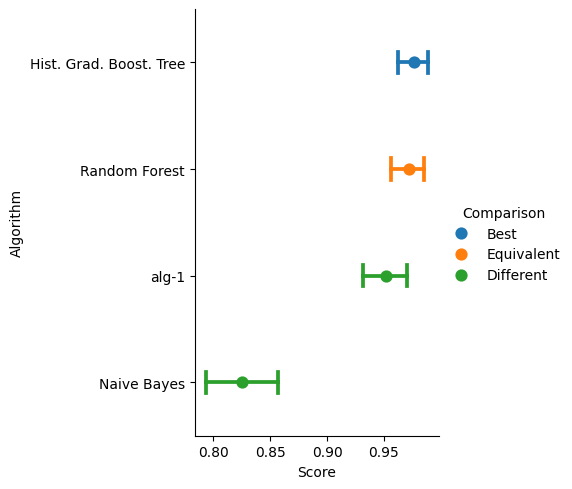
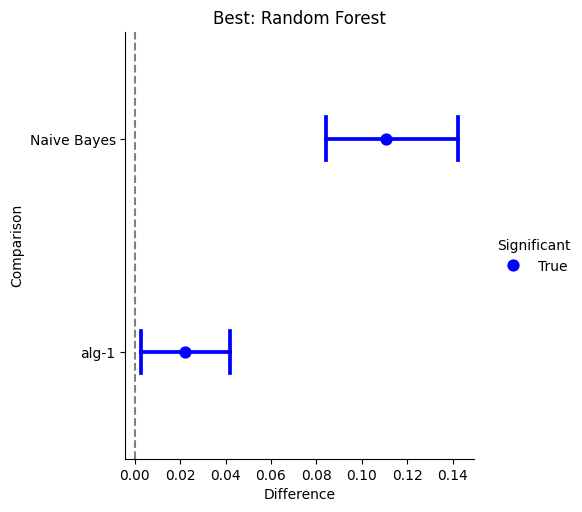

:mod:`CompStats.metrics`
==================================

.. image:: https://github.com/INGEOTEC/CompStats/actions/workflows/test.yaml/badge.svg
		:target: https://github.com/INGEOTEC/CompStats/actions/workflows/test.yaml

.. image:: https://coveralls.io/repos/github/INGEOTEC/CompStats/badge.svg?branch=develop
		:target: https://coveralls.io/github/INGEOTEC/CompStats?branch=develop

.. image:: https://badge.fury.io/py/CompStats.svg
		:target: https://badge.fury.io/py/CompStats

.. image:: https://dev.azure.com/conda-forge/feedstock-builds/_apis/build/status/compstats-feedstock?branchName=main
	    :target: https://dev.azure.com/conda-forge/feedstock-builds/_build/latest?definitionId=20297&branchName=main

.. image:: https://img.shields.io/conda/vn/conda-forge/compstats.svg
		:target: https://anaconda.org/conda-forge/compstats

.. image:: https://img.shields.io/conda/pn/conda-forge/compstats.svg
		:target: https://anaconda.org/conda-forge/compstats

.. image:: https://readthedocs.org/projects/compstats/badge/?version=latest
		:target: https://compstats.readthedocs.io/en/latest/?badge=latest

.. image:: https://colab.research.google.com/assets/colab-badge.svg
		:target: https://colab.research.google.com/github/INGEOTEC/CompStats/blob/docs/docs/CompStats_metrics.ipynb

:py:mod:`CompStats.metrics` aims to facilitate performance measurement (with standard errors and confidence intervals) and statistical comparisons between algorithms on a single problem, wrapping the different scores and loss functions found on :py:mod:`~sklearn.metrics`.

To illustrate the use of :py:mod:`CompStats.metrics`, the following snippets show an example. The instructions load the necessary libraries, including the one to obtain the problem (e.g., digits), four different classifiers, and the last line is the score used to measure the performance and compare the algorithm. 

>>> from sklearn.svm import LinearSVC
>>> from sklearn.naive_bayes import GaussianNB
>>> from sklearn.ensemble import RandomForestClassifier
>>> from sklearn.datasets import load_digits
>>> from sklearn.model_selection import train_test_split
>>> from sklearn.base import clone
>>> from CompStats.metrics import f1_score

The first step is to load the digits problem and split the dataset into training and validation sets. The second step is to estimate the parameters of a linear Support Vector Machine and predict the validation set's classes. The predictions are stored in the variable :py:attr:`hy`.

>>> X, y = load_digits(return_X_y=True)
>>> _ = train_test_split(X, y, test_size=0.3)
>>> X_train, X_val, y_train, y_val = _
>>> m = LinearSVC().fit(X_train, y_train)
>>> hy = m.predict(X_val)

Once the predictions are available, it is time to measure the algorithm's performance, as seen in the following code. It is essential to note that the API used in :py:mod:`~sklearn.metrics` is followed; the difference is that the function returns an instance with different methods that can be used to estimate different performance statistics and compare algorithms. 

>>> score = f1_score(y_val, hy, average='macro')
>>> score
<Perf(func=f1_score, statistic=0.9521, se=0.0097)>

The previous code shows the macro-f1 score and, in parenthesis, its standard error. The actual performance value is stored in the attributes :py:func:`~CompStats.interface.Perf.statistic` and :py:func:`~CompStats.interface.Perf.se`

>>> score.statistic, score.se
(0.9521479775366307, 0.009717884979482313)

Continuing with the example, let us assume that one wants to test another classifier on the same problem, in this case, a random forest, as can be seen in the following two lines. The second line predicts the validation set and sets it to the analysis. 

>>> ens = RandomForestClassifier().fit(X_train, y_train)
>>> score(ens.predict(X_val), name='Random Forest')
<Perf(func=f1_score)>
Statistic with its standard error (se)
statistic (se)
0.9720 (0.0076) <= Random Forest
0.9521 (0.0097) <= alg-1

Let us incorporate another predictions, now with Naive Bayes classifier, and Histogram Gradient Boosting as seen below.

>>> nb = GaussianNB().fit(X_train, y_train)
>>> score(nb.predict(X_val), name='Naive Bayes')
>>> hist = HistGradientBoostingClassifier().fit(X_train, y_train)
>>> score(hist.predict(X_val), name='Hist. Grad. Boost. Tree')
<Perf(func=f1_score)>
Statistic with its standard error (se)
statistic (se)
0.9759 (0.0068) <= Hist. Grad. Boost. Tree
0.9720 (0.0076) <= Random Forest
0.9521 (0.0097) <= alg-1
0.8266 (0.0159) <= Naive Bayes

The performance, its confidence interval (5%), and a statistical comparison (5%) between the best performing system with the rest of the algorithms is depicted in the following figure.

>>> score.plot()

The final step is to compare the performance of the four classifiers, which can be done with the :py:func:`~CompStats.interface.Perf.difference` method, as seen next.  

>>> diff = score.difference()
>>> diff
<Difference>
difference p-values  w.r.t Hist. Grad. Boost. Tree
0.0000 <= Naive Bayes
0.0100 <= alg-1
0.3240 <= Random Forest

The class :py:class:`~CompStats.Difference` has the :py:class:`~CompStats.Difference.plot` method that can be used to depict the difference with respectto the best.

>>> diff.plot()

Multi-measure Perf
--------------------

A single competition can also be evaluated with more than one measure at once (e.g., macro-F1 together with macro-recall) by passing a list of functions to :py:attr:`func`. Score-type and error-type measures, with different Bigger-is-Better (BiB) directions, can even be combined this way into a single :py:class:`~CompStats.interface.Perf` instance, as long as each callable is tagged with its own :py:attr:`BiB` (or a matching list is passed to :py:attr:`BiB`). Every measure is evaluated on the same bootstrap resamples, so comparisons across algorithms remain paired for each measure.

Every :py:mod:`CompStats.metrics` wrapper exposes a ``.measure`` factory (e.g. :py:func:`~CompStats.metrics.f1_score.measure`) that builds the tagged callable used internally as :py:attr:`func`; call it directly to compose several measures, as shown next.

>>> from CompStats.interface import Perf
>>> from CompStats.metrics import f1_score, recall_score
>>> mperf = Perf(y_val, hy, forest=ens.predict(X_val),
...              func=[f1_score.measure(average='macro'),
...                    recall_score.measure(average='macro')],
...              measure_names=['macro-F1', 'macro-Recall'])
>>> mperf
<Perf(func=macro-F1+macro-Recall)>
Statistic with its standard error (se)
statistic (se)
0.9783 (0.0061), 0.9786 (0.0060) <= forest
0.9440 (0.0098), 0.9442 (0.0098) <= alg-1

:py:attr:`measure_names` is optional; when omitted, each measure is labeled with its function's ``__name__`` (e.g. ``f1_score``, ``recall_score``). The properties :py:func:`~CompStats.interface.Perf.statistic`, :py:func:`~CompStats.interface.Perf.se`, and :py:func:`~CompStats.interface.Perf.ci` return one value per measure for every system.

>>> mperf.statistic
{'forest': array([0.97828319, 0.97855524]), 'alg-1': array([0.94399193, 0.94424915])}
>>> mperf.se
{'forest': array([0.00605715, 0.00595743]), 'alg-1': array([0.0098302 , 0.00978099])}
>>> mperf.ci
{'alg-1': (array([0.92393337, 0.92473771]), array([0.96193002, 0.96198806])), 'forest': (array([0.96618741, 0.9666813 ]), array([0.98902657, 0.98936809]))}

:py:func:`~CompStats.interface.Perf.plot` facets the resulting figure by measure, and :py:func:`~CompStats.interface.Perf.difference` reports one p-value per measure for each system compared to the best.

>>> mperf.plot()
>>> mperf.difference()
<Difference>
difference p-values
forest, forest <= Best
0.0000, 0.0000 <= alg-1
1.0000, 1.0000 <= forest

The convenience wrappers :py:func:`~CompStats.metrics.macro_f1`, :py:func:`~CompStats.metrics.macro_recall`, and :py:func:`~CompStats.metrics.macro_precision` are ready-made, multi-measure-friendly shortcuts for macro-averaged F1, recall, and precision; each also exposes its own ``.measure`` factory (e.g. :py:func:`~CompStats.metrics.macro_f1.measure`), so they can be combined the same way as any other :py:mod:`CompStats.metrics` wrapper.

>>> from CompStats.metrics import macro_f1, macro_recall
>>> Perf(y_val, hy, forest=ens.predict(X_val),
...      func=[macro_f1.measure(), macro_recall.measure()])
<Perf(func=f1_score+recall_score)>
Statistic with its standard error (se)
statistic (se)
0.9783 (0.0061), 0.9786 (0.0060) <= forest
0.9440 (0.0101), 0.9442 (0.0101) <= alg-1

.. automodule:: CompStats.metrics
   :members: